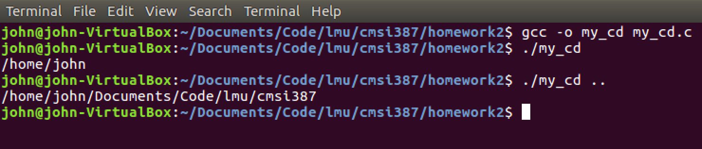
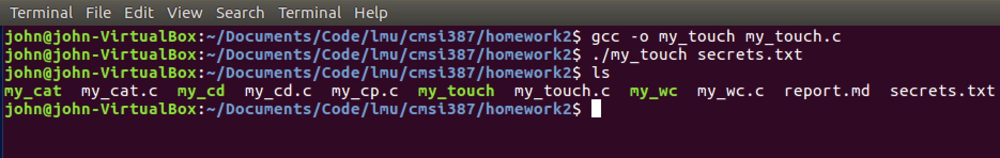
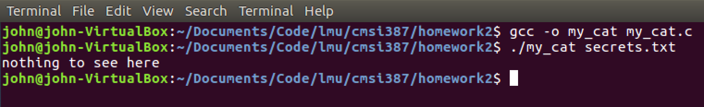
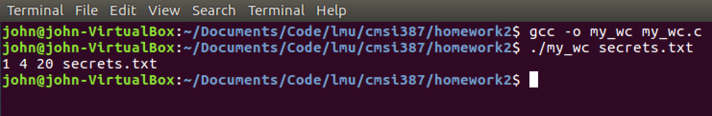

## Homework 2: Sys-iphus
#### John Scott

### my_cd.c
Accepts 0 or 1 arguments

Example: 

### my_touch.c
Accepts 1 argument

Example: 

### my_cat.c
Accepts 1 argument

Example: 

### my_wc.c
Accepts 1 argument

Example: 

### my_cp.c
*Incomplete attempt included in zip file*
