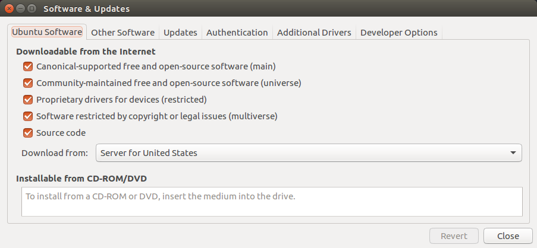
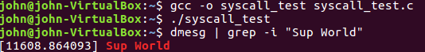

## Homework 3: Kernel Desires
#### John Scott

The following is a tutorial, using an Ubuntu distribution, on adding a simple System Call to a kernel, recompiling the kernel, and rebooting from it to run a custom System Call.

## Tutorial


### Part 1: Installing Ubuntu and Obtaining the Source

#### Step A: Installing Ubuntu
To install Ubuntu I used a new VirtualBox image with 50GB's of space, Dynamically Sized (however any amount over 35GB's should work fine). Make sure to maximize the RAM and processors given to the VirtualBox image to speed up the compilation process and general performance.

#### Step B: Obtaining the Source
Once Ubuntu is running open Terminal and enter the command `software-properties-gtk` and a window should pop up. Check the box next to "Source code." So the Software & Updates window should look like this:


 Next enter the commands `apt-get source linux-image-$(uname -r)` and `sudo apt-get build-dep linux-image-$(uname -r)`.


### Part 2: Adding the System Call

#### Step A: Editing the Syscall Table
Enter the directory `linux-4.x/arch/x86/entry/syscalls/` and edit the `syscall_64.tbl` file. Add something similar to `333	64	supworld	sys_supworld` to the end of the syscalls for 64-bit processors.

#### Step B: Adding to Header file
Enter the directory `linux-4.x/include/linux/` and edit the `syscalls.h` file. At the very end of the file (after #endif) add something similar to `asmlinkage int sys_supworld`.

#### Step C: Creating the Syscall
Enter the directory `linux-4.x/kernel/` and add the `supworld.c` file (or something similar). For example: `supworld.c`

```c
#include <linux/kernel.h>
#include <linux/init.h>
#include <linux/syscalls.h>
#include <linux/linkage.h>

asmlinkage int sys_supworld(void) {
	printk("Sup World\n");
	return 0;
}
```

#### Step D: Editing Makefile Files
Enter the directory `linux-4.x/kernel/` and edit the `Makefile` file. Add something similar to `supworld.o` to the obj-y list. Then enter the directory `linux-4.x/` and edit the `Makefile` file. Add something similar to `.syscall` after `EXTRAVERSION = `.


### Part 3: Building the Kernel and Rebooting

#### Step A: Builing the Kernel
***This step can take several hours depending on the allocated processors***

In Terminal, (in the `linux-4.x/` directory) enter the command `export CONCURRENCY_LEVEL=4` and substitute `4` for the number of processors given to the VirtualBox image (I gave mine four processors and it took about 45 minutes). Next enter the following two commands:
```
fakeroot debian/rules clean
fakeroot debian/rules binary-headers binary-generic binary-perarch
```
The second command will begin the compiling process which can take a while.

#### Step B: Rebooting
After recompiling the kernel, there should be several new `.deb` files in the Home directory. Run the following commands on the similar named files:
```
sudo dpkg -i linux-headers-4.13.0-37_4.13.0-37.42~16.04.1_all.deb
sudo dpkg -i linux-headers-4.13.0-37-generic_4.13.0-37.42~16.04.1_amd64.deb
sudo dpkg -i linux-image-4.13.0-37-generic_4.13.0-37.42~16.04.1_amd64.deb
```
Then enter the command `sudo reboot` and hold the Shift key when the VirtualBox logo appears. Enter Advanced Options and select the custom kernel.


### Part 4: Testing the System Call

#### Step A: Writing Test Program
Write a simple C program to run the custom syscall, for example: `syscall_test.c`

```c
#include <stddef.h>
#include <unistd.h>

int main()  {
        syscall(333, NULL);   // 333 is the supworld syscall index
        return 0;
}

```

#### Step B: Checking Kernel Log
Now it's time for the final step, testing! Enter the following commands into Terminal:
```
gcc -o syscall_test syscall_test.c
./syscall_test
dmesg | grep -i "Sup World"
```
This compiles the C program that runs the syscall, runs the program, and then searches the kernel log for "Sup World" (which should've been printed into the kernel log if the syscall worked!). This should look something like this:

